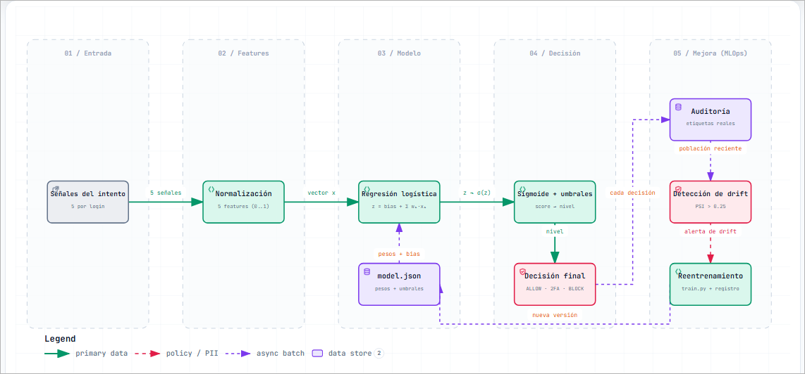

# Cómo funciona el modelo de ML

> Documento de apoyo para estudiantes. Explica, con el código real delante, **qué modelo usa el MVP**, **cómo opina** (de la señal al `score`) y **cómo el backend convierte esa opinión en una decisión**.
>
> Código relacionado: `services/access-risk-model/src/risk_model.py` (inferencia), `services/access-risk-model/train.py` (entrenamiento), `services/access-risk-model/retrain.py` (reentrenamiento), `services/access-risk-api/src/usecases/usecase-access-risk.js` (decisión).

<picture>
  <source media="(prefers-color-scheme: dark)" srcset="diagramas/modelo-readme-dark.png">
  
</picture>

---

## 1. En una frase

El modelo es una **regresión logística** que combina **5 señales** de un intento de acceso y devuelve una **probabilidad de riesgo** (`score` entre 0 y 1). El modelo **no decide**: *opina*. El backend (`access-risk-api`) traduce esa opinión en una decisión de negocio: **permitir, exigir 2FA o bloquear**.

---

## 2. Qué modelo es y por qué

| Aspecto | Detalle |
|---|---|
| Algoritmo | **Regresión logística** (clasificador lineal) |
| Entrenamiento | Descenso de gradiente, con **solo la librería estándar de Python** (sin frameworks, sin GPU) |
| Artefacto | `services/access-risk-model/model.json` (versionado) |
| Despliegue | Se reemplaza el archivo, **sin recompilar** el servicio |
| Determinismo | Semilla fija (`random.seed(42)`), resultado reproducible |

**¿Por qué el modelo más simple posible?** Porque el valor del sistema no está en el algoritmo, sino en la ingeniería que lo rodea. Una regresión logística es **explicable** (se leen sus pesos), **determinista** (mismo dato → mismo resultado), **rápida** (microsegundos) y **suficiente** para el objetivo. El modelo es un **componente intercambiable**: si mañana conviene otro, se reemplaza el artefacto.

---

## 3. Entradas: las 5 señales del intento

Cada intento de acceso se describe con cinco señales. Se validan en `risk_model.py:26`:

| Señal | Tipo | Rango | Significado |
|---|---|---|---|
| `deviceKnown` | booleano | `true`/`false` | ¿El dispositivo es de confianza? |
| `failedAttempts` | entero | 0–5 | Intentos fallidos recientes |
| `locationShiftKm` | entero | 0–1000 | Cambio de ubicación respecto a lo habitual |
| `hour` | entero | 0–23 | Hora del intento |
| `velocityKmh` | entero | 0–1200 | Velocidad de desplazamiento implausible |

Si un valor está fuera de rango o falta, el servicio responde **400** (validación temprana).

---

## 4. De señales a *features* (normalización)

El modelo no usa las señales crudas, sino cinco *features* en el rango `0..1` (`risk_model.py:73`):

| Feature | Cómo se calcula | Lectura |
|---|---|---|
| `deviceUnknown` | `deviceKnown`? → `0`; si no → `1` | Dispositivo desconocido |
| `failedAttempts` | `failedAttempts / 5` | Más intentos fallidos ⇒ más riesgo |
| `locationShift` | `locationShiftKm / 1000` | Ubicación más improbable |
| `unusualHour` | `1` si `hour < 6` ó `hour >= 23`, si no `0` | Madrugada |
| `velocity` | `velocityKmh / 1200` | Desplazamiento a velocidad imposible |

> Normalizar a `0..1` hace que los pesos sean comparables entre señales y estabiliza el entrenamiento.

---

## 5. La fórmula: cómo "opina"

Primero combina las features con sus **pesos** y un **sesgo** (*bias*), y luego pasa el resultado por la función **sigmoide**:

```text
z     = bias + Σ (peso_i · feature_i)
score = σ(z) = 1 / (1 + e^(−z))          # score ∈ (0, 1)
```

Se implementa en `risk_model.py:89`. Pesos de la versión activa (`model.json`, `1.0.0`):

| Feature | Peso | Efecto sobre el riesgo |
|---|---|---|
| `deviceUnknown` | **2.42** | el factor de mayor peso |
| `locationShift` | 1.54 | ubicación improbable |
| `failedAttempts` | 1.25 | intentos fallidos recientes |
| `velocity` | 1.21 | velocidad de desplazamiento implausible |
| `unusualHour` | 0.90 | horario inusual (madrugada) |
| `bias` | **−2.13** | por defecto, el intento tiende a riesgo **bajo** |

**Cómo leerlo:** un peso **positivo** empuja el `score` hacia arriba (más riesgo); el **bias negativo** hace que, sin señales sospechosas, el riesgo sea bajo. La sigmoide aplasta cualquier valor `z` al rango `(0, 1)`, que es lo que interpretamos como probabilidad.

---

## 6. De `score` a nivel

El `score` continuo se traduce a un nivel discreto con **dos umbrales** (`risk_model.py:82`):

| `score` | Nivel |
|---|---|
| `< 0.33` | **LOW** |
| `0.33 – 0.66` | **MEDIUM** |
| `> 0.66` | **HIGH** |

Los umbrales no son una verdad estadística: son una **decisión de negocio** (cuánta fricción toleramos). Viven en `model.json` y son ajustables.

---

## 7. Cómo opina vs. cómo se decide (lo importante)

```text
        EL MODELO OPINA                    EL BACKEND DECIDE
   ┌───────────────────────┐        ┌───────────────────────────┐
   │ score + nivel         │        │ LOW    → ALLOW            │
   │ (NO decide nada)      │───────►│ MEDIUM → REQUIRE_2FA      │
   │ modelVersion, latency │        │ HIGH   → BLOCK            │
   └───────────────────────┘        └───────────────────────────┘
       access-risk-model                access-risk-api
```

- El modelo devuelve `{ score, level, modelVersion, latencyMs }` (`risk_model.py:110`).
- El backend es el único que decide, mapeando el nivel (`usecase-access-risk.js`):
  - `LOW → ALLOW` (sin fricción)
  - `MEDIUM → REQUIRE_2FA` (fricción proporcional)
  - `HIGH → BLOCK` (protección)
- **Ante la duda** (modelo caído o *timeout*), el backend aplica **fallback: `REQUIRE_2FA`**. El login nunca se cae.

---

## 8. Ejemplos numéricos (con la versión `1.0.0`)

| Escenario | `deviceUnknown` | `failedAttempts` | `locationShift` | `unusualHour` | `velocity` | `z` | `score` | Nivel | Decisión |
|---|---|---|---|---|---|---|---|---|---|
| Bajo | 0 | 0.0 | 0.005 | 0 | 0.008 | −2.113 | **0.1079** | LOW | ALLOW |
| Medio | 0 | 0.4 | 0.400 | 0 | 0.333 | −0.610 | **0.3521** | MEDIUM | REQUIRE_2FA |
| Alto | 1 | 0.6 | 0.900 | 1 | 0.750 | 4.234 | **0.9857** | HIGH | BLOCK |

**Traza del escenario alto:**

```text
z = −2.1306
  + 2.4155·1      (deviceUnknown)
  + 1.2526·0.6    (failedAttempts)
  + 1.5412·0.9    (locationShift)
  + 0.9032·1      (unusualHour)
  + 1.2092·0.75   (velocity)
  = 4.2337
score = σ(4.2337) = 1 / (1 + e^−4.2337) = 0.9857
```

> El escenario alto combina **dispositivo desconocido + muchos intentos + ubicación improbable + madrugada + velocidad alta**: el `score` se dispara y el backend bloquea.

---

## 9. Cómo se entrena (`train.py`)

El entrenamiento es **autocontenido y reproducible** (solo librería estándar):

1. **Datos sintéticos** (`train.py:50`): 4.000 intentos generados con `random.seed(42)`. Cada intento se etiqueta (`fraude`/`legítimo`) usando una **verdad latente** (`TRUE_WEIGHTS` / `TRUE_BIAS`) y una probabilidad Bernoulli. Así el modelo tiene una señal real que aprender.
2. **Descenso de gradiente** (`train.py:67`): 6.000 épocas, tasa de aprendizaje `0.5`, con la mitad de los datos para entrenar y la otra para validar.
3. **Validación**: se mide `accuracy` sobre ejemplos no vistos. En el artefacto actual: **0.694**.
4. **Persistencia**: escribe `model.json`, lo archiva en `models/model-1.0.0.json` y registra la versión en `models/registry.json`. Si `MLFLOW_TRACKING_URI` está configurado, además registra el *run* en MLflow.

Los pesos aprendidos terminan muy cerca de los "verdaderos" (p. ej. `deviceUnknown` ≈ 2.42 aprendido vs. 2.2 real): el modelo **recupera** la relación que había en los datos.

---

## 10. El artefacto `model.json`

| Campo | Qué contiene |
|---|---|
| `version` | Versión del modelo (`1.0.0`) |
| `features` | Nombres y orden de las 5 features |
| `weights` | Un peso por feature |
| `bias` | Sesgo de la combinación lineal |
| `thresholds` | Umbrales `low` / `high` para el nivel |
| `reference` | Histograma de `locationShift` y tasa de dispositivo desconocido (para detectar *drift*) |
| `metrics` | Precisión de validación y tamaño del set de entrenamiento |

Reemplazar este archivo (vía promoción de versión) cambia el comportamiento del modelo **sin recompilar ni redesplegar** el servicio.

---

## 11. Data drift (¿el modelo sigue siendo válido?)

El modelo aprende de una distribución de datos; si el "mundo" cambia, deja de servir aunque el código no cambie. El servicio lo vigila con **PSI** (*Population Stability Index*, `risk_model.py:113`):

- Guarda una ventana de las últimas **200** ubicaciones normalizadas.
- Compara su distribución (10 *bins*) contra la distribución de **referencia** guardada en `model.json`.
- `PSI = Σ (actual − esperado) · ln(actual / esperado)`; si **PSI > 0.25**, se marca **drift detectado** y el panel de operación alerta.

Detectar el *drift* es lo que **dispara el reentrenamiento** antes de que el modelo se degrade en silencio.

---

## 12. Reentrenamiento y puerta de calidad (`retrain.py`)

El reentrenamiento **no despliega automáticamente**: pasa por una **puerta de calidad** (patrón *champion/challenger*).

1. Se entrena un **candidato** con datos nuevos.
2. Se compara contra el **modelo actual** sobre datos de validación.
3. Se promueve **solo si mejora** y supera una precisión mínima (`MIN_ACCURACY = 0.60`).
4. Si se promueve: se crea la versión `1.0.1`, se archiva el artefacto y se actualiza `registry.json`. Si no, se descarta y se conserva el vigente.

Esto evita que la automatización **empeore** el sistema. El registro (`models/registry.json`) permite además **revertir** a una versión anterior.

---

## 13. Contrato del servicio de inferencia

| Método | Ruta | Devuelve |
|---|---|---|
| `POST` | `/predict` | `{ score, level, modelVersion, latencyMs }` |
| `GET` | `/model` | Info del modelo activo (versión, features, pesos, umbrales) |
| `GET` | `/model/versions` | Registro de versiones |
| `GET` | `/metrics` | Conteos, latencia y estado de *drift* |

Las operaciones de gestión (`retrain`, `promote`, `rollback`, `drift`, `reset`) están **protegidas** y solo se alcanzan a través del backend (`/v1/model/*`, con rol administrador).

---

## 14. Pruébalo tú

```bash
# 1) El modelo "opina" a través de un login de demo (vía mock-auth -> access-risk-api -> modelo)
#    Escenario de riesgo alto -> el backend decide BLOCK
curl -s -X POST http://localhost:8210/demo/login -H "Content-Type: application/json" \
  -d '{"username":"demo","signals":{"deviceKnown":false,"failedAttempts":3,"locationShiftKm":900,"hour":3,"velocityKmh":900}}'

# 2) Ver los pesos activos del modelo (requiere sesión)
TOKEN=$(curl -s -X POST http://localhost:8210/v1/auth/login -H "Content-Type: application/json" \
  -d '{"email":"viewer@enviame.io","password":"viewer123"}' | grep -o '"token":"[^"]*"' | cut -d'"' -f4)
curl -s -H "Authorization: Bearer $TOKEN" http://localhost:8210/v1/model/info

# 3) Reentrenar (solo administrador) y ver la puerta de calidad
ADMIN=$(curl -s -X POST http://localhost:8210/v1/auth/login -H "Content-Type: application/json" \
  -d '{"email":"admin@enviame.io","password":"admin123"}' | grep -o '"token":"[^"]*"' | cut -d'"' -f4)
curl -s -X POST -H "Authorization: Bearer $ADMIN" -H "Content-Type: application/json" \
  -d '{"conceptDrift":true}' http://localhost:8210/v1/model/retrain
```

También puedes **entrenar localmente** (sin Docker):

```bash
cd services/access-risk-model
python train.py        # escribe model.json (semilla fija -> reproducible)
```

---

## 15. Preguntas frecuentes

| Pregunta | Respuesta breve |
|---|---|
| ¿Por qué regresión logística y no una red neuronal? | Explicable, determinista, sin GPU y más que suficiente; el modelo es intercambiable (se reemplaza el artefacto). |
| ¿El modelo bloquea a un usuario? | **No.** Solo devuelve `score`/`nivel`. La decisión (`ALLOW`/`2FA`/`BLOCK`) la toma el backend. |
| ¿Qué pasa si el modelo falla o tarda? | El backend aplica *fallback*: exige 2FA. El login nunca se cae. |
| ¿Cómo sé que el modelo sigue sirviendo? | Métricas de `/metrics` + detección de *drift* (PSI > 0.25). |
| ¿Cómo mejora con el tiempo? | Feedback (resultado real `fraude`/`legítimo`) → reentrenamiento → **puerta de calidad** → nueva versión. |
| ¿De dónde salen los datos? | Sintéticos y reproducibles (semilla fija) para el MVP; el diseño admite datos reales etiquetados. |
| ¿Qué cambia entre versiones del modelo? | Los pesos/bias y las métricas; el contrato de la API no cambia (se reemplaza el artefacto). |
